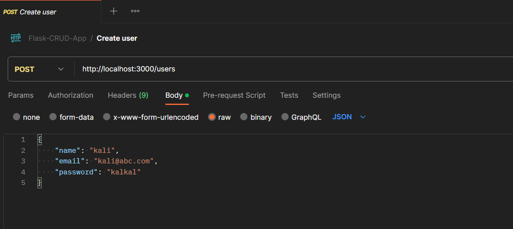
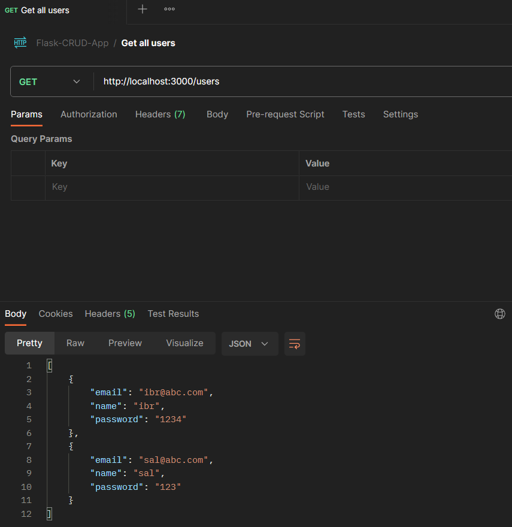
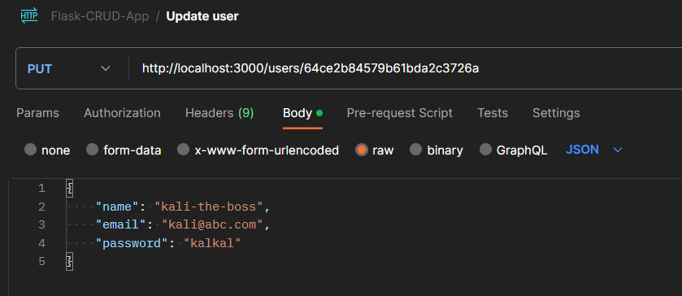
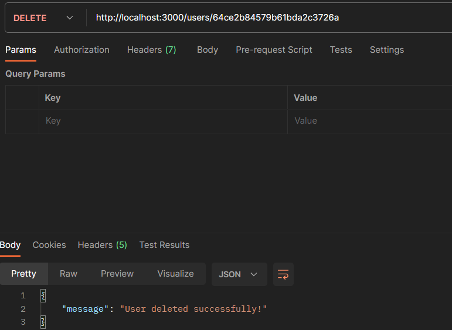

# RESTful CRUD API using Flask

Flask application that performs CRUD (Create, Read, Update, Delete) operations on a MongoDB database for a User resource using a REST API. The REST API endpoints are accessible via HTTP requests and tested using Postman.

Have a look at the Postman Collection - 
https://www.postman.com/telecoms-technologist-44260770/workspace/my-workspace/collection/26804310-1da79de5-9e53-4969-ad4b-fdbbe097a7b0?action=share&creator=26804310

## Requirements

- Python 3.8 or higher
- MongoDB Atlas account
- Docker (optional, for containerized deployment)

## Set up Instructions

1. Clone the repository 

`   git clone https://github.com/ibr03/flask-CRUD-app.git
    cd flask-CRUD-app
`

2. Create a virtual environment and then activate it:

`   python -m venv venv
`

`   venv\Scripts\activate
`

3. Install required packages:

`   pip install -r requirements.txt
`

4. Create .env file and set up your PORT and MONGO_URI

5. Run the app

`   python run.py
`

The app should now be running on 'http://localhost:3000'.

## API Endpoints
* GET /users - Returns a list of all users.
* GET /users/<user_id> - Returns the user with the specified ID.
* POST /users - Creates a new user with the specified data.
* PUT /users/<user_id> - Updates the user with the specified ID with the new data.
* DELETE /users/<user_id> - Deletes the user with the specified ID.

## Docker Deployment

To deploy the app using Docker, follow these steps:

1. Build the Docker image:

`   docker build -t flask-app .
`

2. Run the Docker container:

`   docker run -p 3000:3000 flask-app
`

